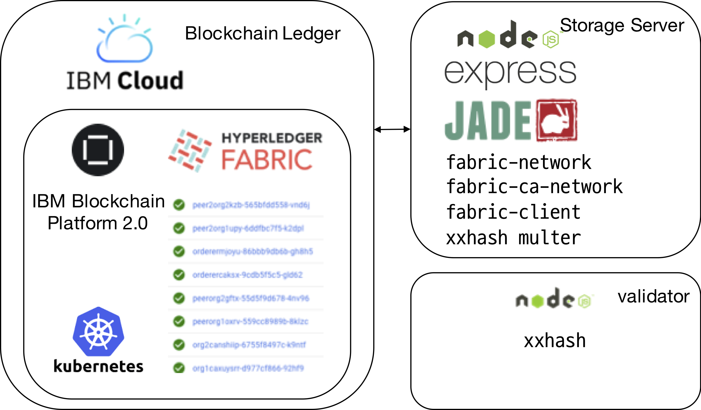

# datastorage-fabric
>A simple data storage managed with Hyperledger Fabric based on [FabCar Blockchain Sample](https://github.com/IBM/fabcar-blockchain-sample).

This project aims to develop a PoC(Proof-of-Concept) model of data storage formed with Hyperledger Fabric, a private Blockchain solution. In this application, data are uploaded by using REST API with user credentials. And each user can validate data by using in-app validator with hash data.

The application is consisted of following modules:
* Server
* Smart Contracts
* Validator

This project is implementation of the dissertation '[Design and Implementation of Blockchain-powered Reserach Data Sharing Storage for Transparent Provenance Management](http://ust.dcollection.net/public_resource/pdf/200000201253_20190621164003.pdf)' by Yeongheon Song. For more details, please refer to contents in the thesis.

# Architecture
In this application, a user can:

* Query URI and metadata from Blockchain ledger
* Upload data with version number
* Update data with corresponding version number
* Manage permissions to manaage data (Permit and Revoke)

An full architecture of this system is consisted with various Node modules. [xxHash](http://www.xxhash.com) is used to calculate and validate the hash data of uploaded/downloaded data. [Express.js](https://expressjs.com/) is used to implement REST Server into the application.

# Prerequisites
* [Node.js](https://nodejs.org/download/release/v8.16.0/) (Version 8.16.0 LTS)
* [Visual Studio Code](https://code.visualstudio.com/)
* [IBM Blockchain Platform Extension for VSCode](https://marketplace.visualstudio.com/items?itemName=IBMBlockchain.ibm-blockchain-platform)

# Smart Contract
In this application, there are seven functions in the System:
* `queryAsset()` : Query a single asset without URI information
* `queryAssetbyID(assetID)` : Query a single asset by asset ID for authorized users
* `uploadAsset(Asset)` : Upload a new data
* `updateAsset(assetHistory.assetURI, assetHistory.assetHash)` : Upload a new version of data for existing asset
* `requestAccess(assetID)` : Request access of specific data
* `grantAccess(assetID, requestedBy)` : Grant access of specific data request by `researcherID`
* `revokeAccess(assetID, permissionList)` : Revoke access of specific data request by `researcherID`

## Package the Smart Contract
* Open VS Code and open the `contract` folder and Press `Cmd + Space + P` or `Ctrl + Space + P` to open command palette. 
* And Choose `IBM Blockchain Platform: Package a Smart Contract Project`.
* In the IBM Blockchain Platform Extension, you can export the `ctx` file from the list of package contracts.
* Or, you can simply use prepackaged `ctx` file from `contract/compiled_cds`.

# Server
In this repository, there are two branches, which are `master` and `ibm-cloud`. If you want to deploy Hyperledger Fabric in the local server, please use `master` branch. And if you are using IBM Cloud, please proceed with the `ibm-cloud` branch.

## Deploy in the Local System
Go to IBM Blockchain Platform extension in the VS Code and deploy docker containers into the your local system. If the deployment finishes, you may export the `connection.json` file from the extension. Please move your `connection.json` into the `/Server`.
A packaged smart contracts are must be deployed to process requests from the client. Select a Smart Cotnract which was deployed in the previous step and deploy it using the IBM Blockchain Platform Extension.

## Deploy in the IBM Cloud
Deploy the IBM Blockchain Platform 2.0 from the IBM Cloud. The free k8s cluster service will be sufficient to run this application.
Create the following modules in the IBM Blockchain Platform:
* Three CA (Org1 CA, Org2 CA, Orderer CA)
* Two MSPs (Org1MSP, Org2MSP)
* Four Peers (Peer1 Org1, Peer2 Org1, Peer1 Org2, Peer2 Org2)
* One Orderer (Orderer)
* One Channel (mychannel)
* An account for manage app (AppAdmin)

and export your `connection.json` from the service and move it into the `/Server`.

A packaged smart contracts are must be deployed to process requests from the client. Select a Smart Cotnract which was deployed in the previous step and deploy it using the IBM Blockchain Platform.

## Enroll AppAdmin
In the `config.json`, the admin credential should be saved to make new user account and invoke transactions. Please update credentials with yours.

* Install the node dependencies with `npm install` at `/server` directory.
* run `node enrollAdmin.js` to enroll AppAdmin credentials.

## Register Users
You can modify `config-Org1User2.json` to create multiples users in the organization.

* Register user with `node registerUser.js` and `node registerUser-Org1User2.js`

Configuration in IBM Cloud should be slightly different. Modify it to your uses.

## Run App
* You can run the `node app.js` or `node app-Org1User2.js` to run the API Gateway. In this PoC application, the user credentials are fixed with the gateway.

* You can upload your asset with `http://localhost:8081/uploadAsset` or update the asset with `http://localhost:8081/updateAsset`.
* You can check uploaded data in the `server/src/uploads/` and the hash value with the metadata should be updated in the Blockchain ledger.

* You can query all of assets using `QueryAllAsset` and any other smart contracts are invoked in the REST API.
* Please use `curl` or `httpie` to invoke new transaction.

# License
This application contains copyrighted software under the [Apache Software License, Version 2](https://www.apache.org/licenses/LICENSE-2.0.txt) and the [Developer Certificate of Origin, Version 1.1 (DCO)](https://developercertificate.org).

Copyright (c) 2019 Yeongheon Song under the Apache Software License, Version 2

Copyright (c) 2019 IBM under the Apache Software License, Version 2

